### Laporan Hasil Pratikum 1 - Sistem Administrasi Server 

Nadila Chusnul K - 1202190020

Anastasya Rahma Juniarti - 120219058 

#Hal pertama pastikan adaptop bridge dan setting ip static

        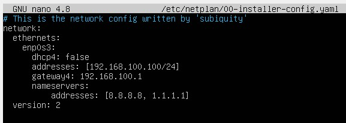

- Check lxc  dari praktikum sebelumnya
    ```bash
    lcx-ls - f
    ```
    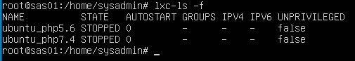

### 1. Mengubah nama container dari ubuntu_php5.6 menjadi ubuntu_landing dengan menyesuaikan ip yang terbaru 
- rename ubuntu_php5.6 to ubuntu_landing
     ```bash 
    lxc-copy -R -n ubuntu_php5.6 -N ubuntu_landing
    ```
  - check list container 
     ```bash 
    lxc-ls -f
     ```
    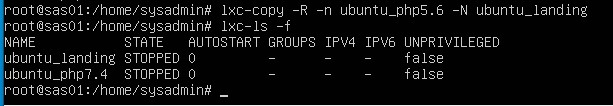

- start lxc php landing dan php 7
    ```bash 
    lxc-start -n ubuntu_landing 
    ```
    

- masuk kedalam container dan buka network interfaces
    ```bash 
    lxc-attach -n ubuntu_landing 
    nano /etc.network/interfaces
    ```
    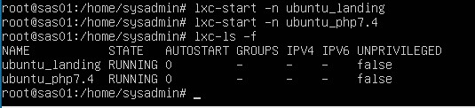

- ubah ip ubuntu landing 

    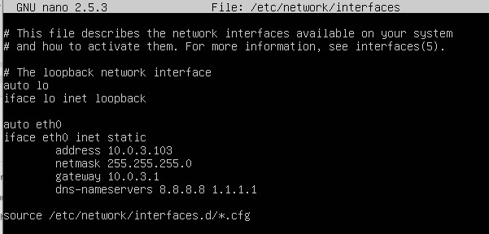

- restart ip. Lalu cek ip menggunakan ifconfig 
    ```bash
    shutdwon now 
    lxc-star -n ubuntu_landing
    lcx-attach -n ubuntu_landing
    ifconfig 
    ```
    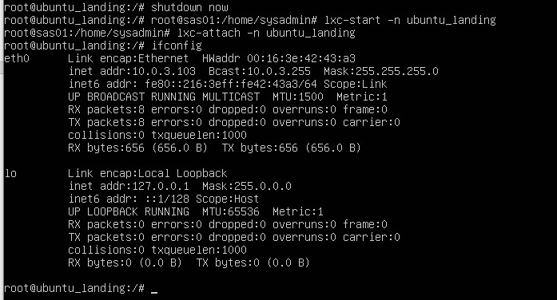

- keluar dari ubuntu landing untuk lanjut sebelumnya 
    ```bash
    exit
    ```
    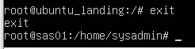

### 2.  Membuat container lxc debian 9 dengan nama debian_php5.6 dengan ip yang baru 
- Cek koneksi internet dengan ping google.com / 8.8.8.8 / 1.1.1.1
    ```bash 
    ping google.com 
    ```
    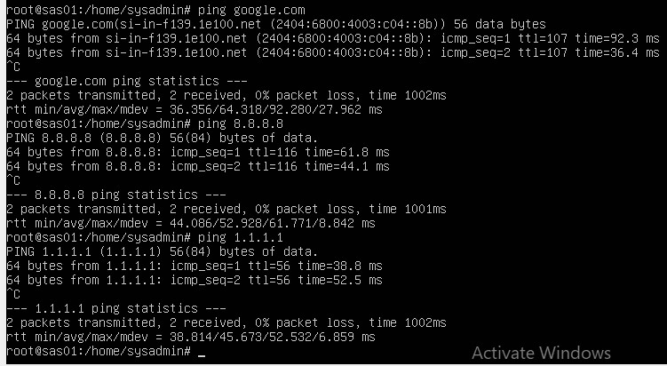
- Update repositori Debian 
    ```bash 
    nano /etc/apt/sources.list
    ```
    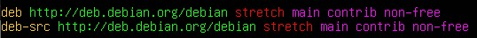
- Install lxc Debian
    ```bash 
    lxc-create -n debian_php5.6 -t download  -- --dist debian ---release stretch ---arch amd64 --force-cache --n0-validate --server imager.linuxcocntainers.org 
    ```
    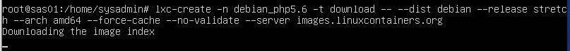

- cek lxc Debian 
    ```bash 
    lxc-ls -f 
    ```
    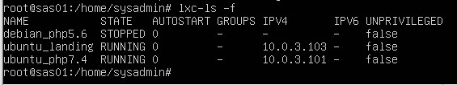

### 3. Setting nginx debian_php5.6 dengan domain http://lxc_php5.dev dan buat keterangan lxc didalam nya

- start lxc debian 
    ```bash 
    lxc-start -n debian_php5.6
    lxc-ls -f
    ```
- install nginx dan nginx-extras di dalam container
    ```bash 
    apt install nginx nginx-extras
    ```
    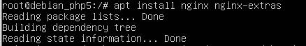

- masuk container dan install net-tools curl  buka network interfaces dan setting ip static debian php
    ```bash 
    apt install nano net-tools curl 
    nano /etc/network/interfaces
    ```
    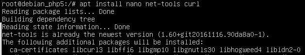
    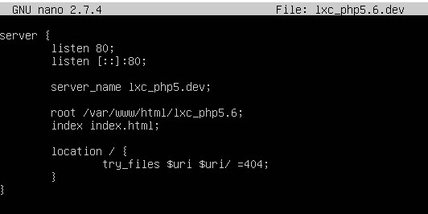

- Restart pengaturan dan cek ip
    ```bash 
    systemctl restrat networking.service
    ifconfig
    ```
    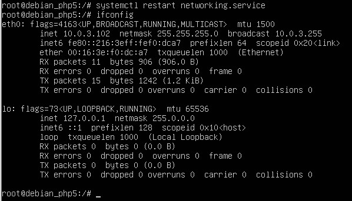

- setting nginx

    masuk kedalam direktori sites available dan buat file kosong dengan nama lxc_php5.6.dev
    ```bash
    cd /etc/nginx/sites-available
    touch lxc_php5.6.dev
    nano lxc_php5.6.dev 
    ```
    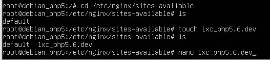
    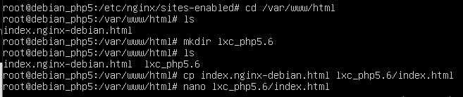
    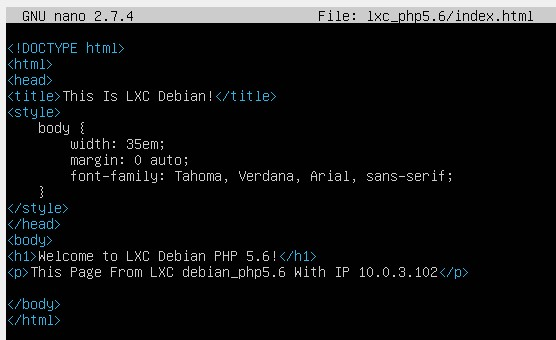
    

- Test dengan curl 
    ```bash 
    curl -i http://lxc_php5.dev 
    ```
    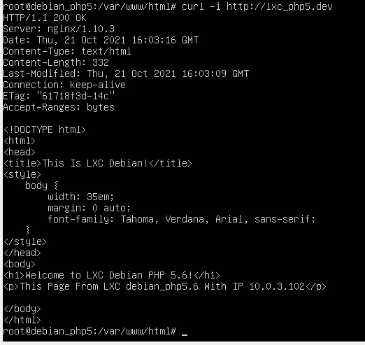

- keluar dari debian php untuk lanjut pada soal selanjtnya 
    ```bash 
    exit 
    ```

### 4. Setting nginx ubuntu_landing dengan domain http://lxc_landing.dev dan buat keterangan lxc didalam nya

- Masuk kedalam container serta masuk ke dalam direktori sites available
    ```bash
    lxc-ls -f
    lxc-attach -n ubtuntu_landing 
    cs /etc.nginx/sites-available 
     ```
    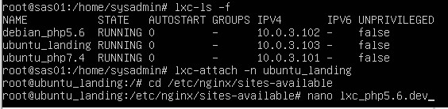

- rename direktori lxc agar tidak bingung 
    ```bash 
    mv lxc_php5.6.dev lxc_landing.dev 
    nano lxc_landing.dev 
    ```
    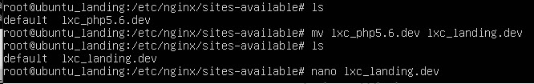
- kemudian masuk pada network interfaces untuk mengedit lxc 
    
    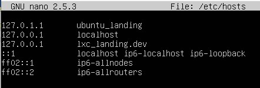

- masuk ke dalam direktori sites enable, membuat symbolic link file container dan melakukan test serta buka file direktori host
    ```bash 
    cd ../sites-enabled
    ln -s /etc/nginx/sites-available/lxc_php5.6.dev 
    nginx -t
    ```
    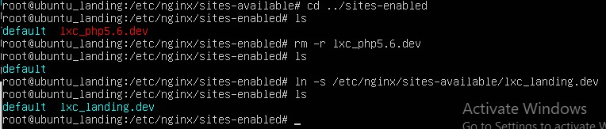

    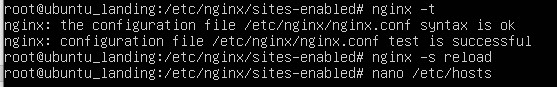

    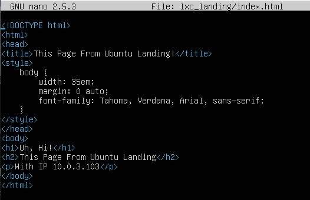

    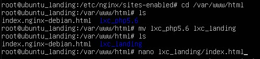

- Test dengan curl
    ```bash 
    curl -i http:///lxc_landing.dev 
    ```
    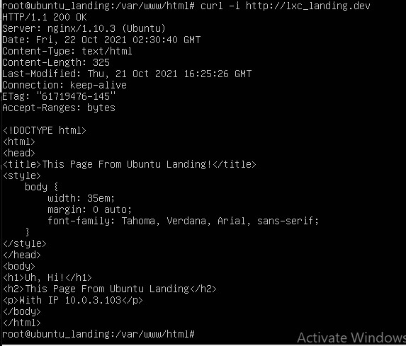

- edit dari ubuntu landing 

### 5. Setting ubuntu landing autostart ketika vm terbuka
- setting config container

    stop ubuntu landing lalu setting config auto start dengan lxc.start.auto = 1
    ```bash 
    lxc-stop -n ubuntu_landing 
    lxc-ls -f 
    ```
- Masuk ke direktori /var/lib/lxc dan cek ada direktori apa saja
    ```bash 
    cd /var/lib/lxc 
    ```
- Menggunakan auto start pada ubuntu landing, tambahkan config sseperti dibawah 

    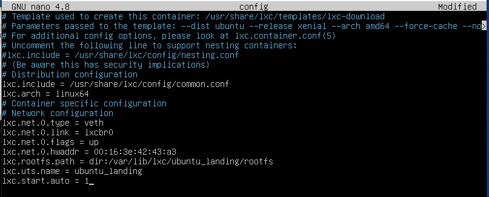

- Cek auto start dengan cara reboot

      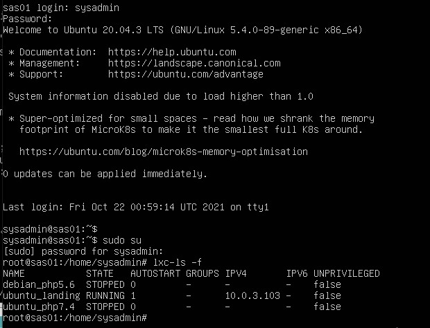
### 6. Setting nginx pada vm sesuai soal
- setting nginx

    setting nginx hosts
    ```bash 
    nano /etc/hosts
    ```
    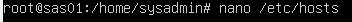

   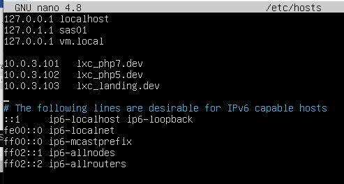


- Masuk ke dalam direktori sites available dan buka vm local

    ```bash 
    cd /etc/nginx/sites-available
    nano vm.local
    ```
    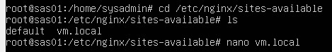
- melakukan test serta mengecek konektivitas ke URL

     ```bash
     sudo nginx -t
     sudo nginx -s reload
     curl -i http://vm.local
     ```
    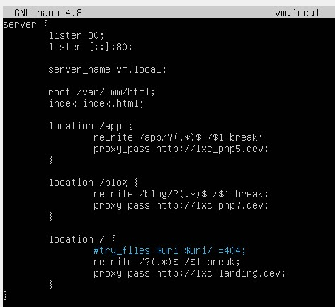
### 7. Pengujian pada web browser ketiga web
- setting host pada windows
-
    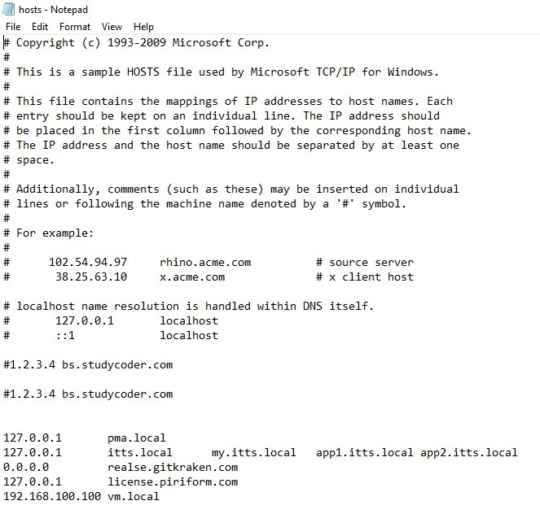
    
    hasil test web 
    - mengakses http://vm.local
    
    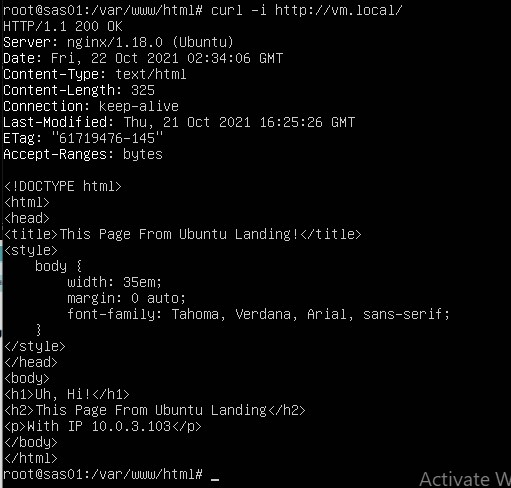
    
    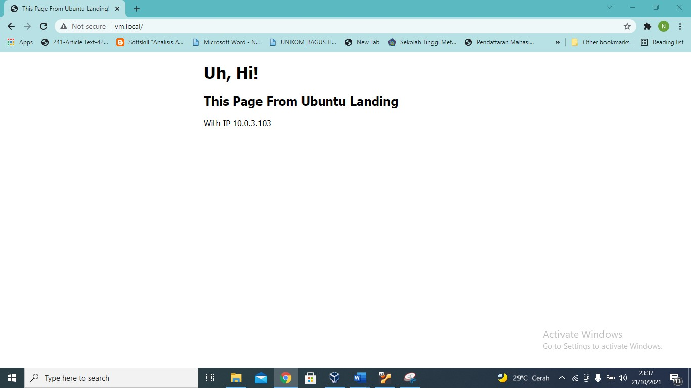

    - mengakses http://vm.local/blog
    
    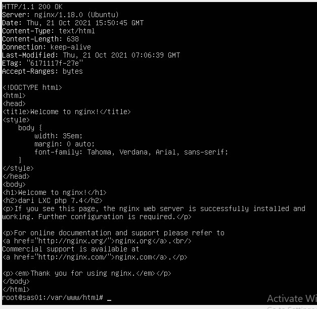
    
    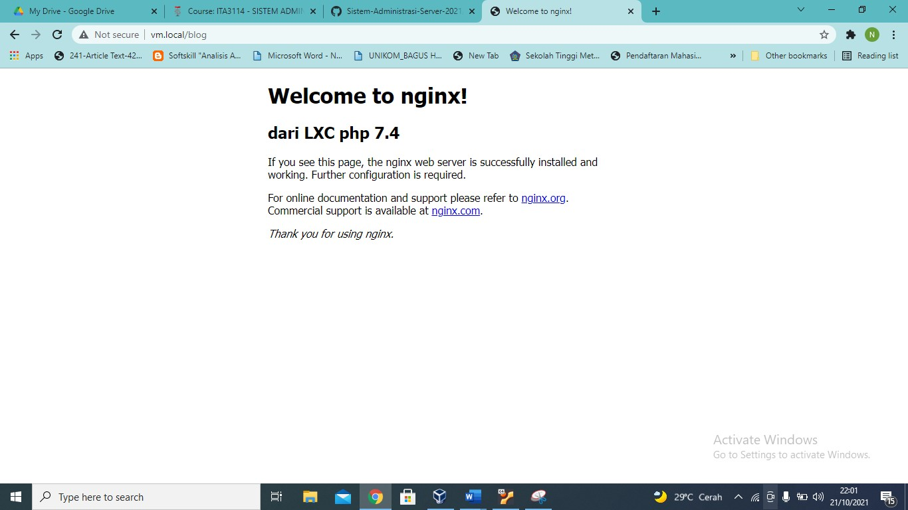

    - mengakses http://vm.local/app
    
     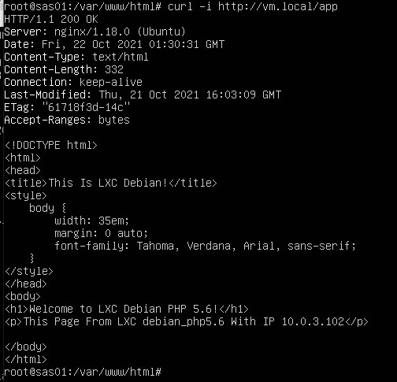
     
     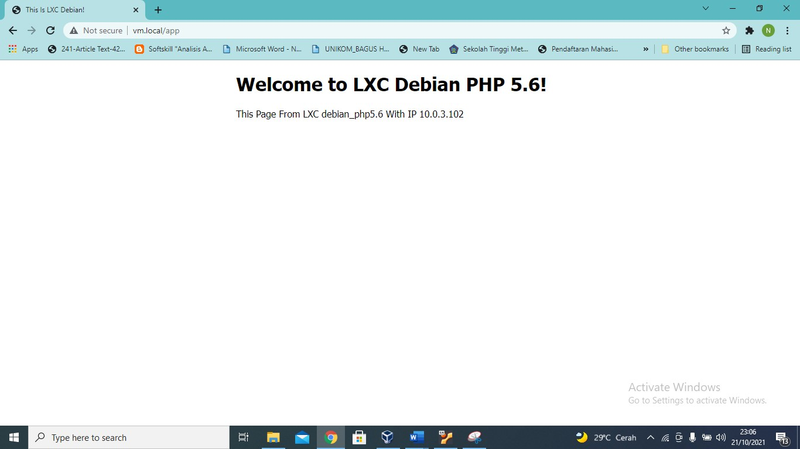   
     
 ### 8. Soal analisa 
    - mengapa untuk kebutuhan php5.6 tidak bisa menggunakan ubuntu 16.04, sehingga perlu diganti os ke debian 9?

        Ubuntu 16.04 will reach the end if otherwise support and unusable on php 5.6

    - kenapa harus menggunakan virtualisasi LXC pada skema website yang akan didevelop?

          Because the website uses Linux. So, using LXC virtualization to make servers easier

    - apa yang dimaksud dengan proxy server? kenapa vm.local bisa kita anggap sebagai proxy server?
    
        A proxy server is a computer program that acts as an intermediary between clients to request content from the Internet or intranet. To control the activity of data               packet traffic that passes through it.
